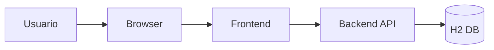
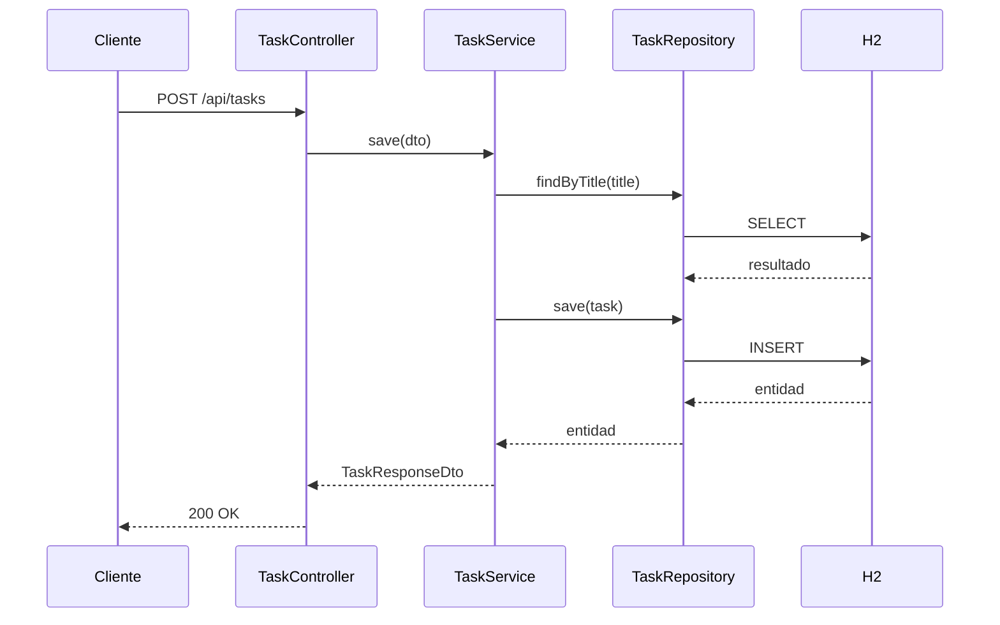

# Gestor de Tareas — Resumen general

Breve descripción

- Aplicación simple para gestionar tareas (crear, listar, buscar, actualizar y eliminar).
- Frontend: SPA en React + TypeScript (Vite, Tailwind).
- Backend: API REST con Spring Boot, JPA y base de datos H2 en memoria.

Checklist de lo incluido

- [x] Qué hace la app
- [x] Tecnologías principales (backend y frontend)
- [x] Endpoints principales del backend
- [x] Comandos rápidos para ejecutar en desarrollo
- [x] Diagramas mermaid simples (arquitectura y secuencia)

Qué hace la aplicación

El sistema permite a los usuarios crear tareas con título, descripción y marcar si están completadas. El frontend consume la API REST del backend para mostrar y modificar las tareas.

Tecnologías

- Backend
  - Java 17
  - Spring Boot 4 (Spring Web, Spring Data JPA)
  - H2 (base de datos en memoria para desarrollo)
  - Jakarta Validation
  - Lombok

- Frontend
  - React 19 + TypeScript
  - Vite
  - TailwindCSS

Resumen de la arquitectura



Endpoints principales (Backend)

Base URL por defecto: http://localhost:8081
Ruta base: /api/tasks

- GET /api/tasks
  - Lista tareas. Soporta filtros por query params: `?title=...` ó `?id=...`.
  - Respuesta: 200 OK, lista de tareas.

- POST /api/tasks
  - Crea una tarea. Body JSON con { title, description, completed }.
  - Validaciones: `title` obligatorio; títulos duplicados producen error.
  - Respuesta: 200 OK con la tarea creada.

- PATCH /api/tasks/{id}
  - Actualiza parcialmente una tarea (title, description, completed).
  - Respuesta: 200 OK con la tarea actualizada.

- DELETE /api/tasks/{id}
  - Elimina la tarea por id.
  - Respuesta: 200 OK con mensaje de confirmación.

Formato de error (ejemplo simplificado)

```json
{
  "message": "Validation failed",
  "status": 400,
  "timestamp": "2026-02-23T10:30:00",
  "errors": {
    "title": "Title cannot be blank"
  }
}
```

Diagrama de secuencia (crear tarea)



Comandos rápidos (desarrollo)

- Backend (desde `backend/gestor-de-tareas`):

```powershell
cd backend\gestor-de-tareas
# Windows
./mvnw.cmd spring-boot:run
# UNIX
./mvnw spring-boot:run
```

- Alternativa: generar el jar y ejecutar

```powershell
cd backend\gestor-de-tareas
./mvnw.cmd package
java -jar target\gestor-de-tareas-*.jar
```

- Frontend (desde `frontend/taskApi`):

```powershell
cd frontend\taskApi
npm install
npm run dev
```

Notas rápidas

- El frontend usa la variable de entorno `VITE_API_URL` para apuntar a la API (fallback: http://localhost:8081/api/tasks).
- El backend expone por defecto el puerto 8081 según `application.properties`.
- La base H2 es en memoria: ideal para desarrollo; datos se pierden al reiniciar.

Contacto y ayuda

Para más detalles revisa los READMEs específicos en `backend/gestor-de-tareas/Readme.md` y `frontend/taskApi/README.md` dentro del repositorio.
