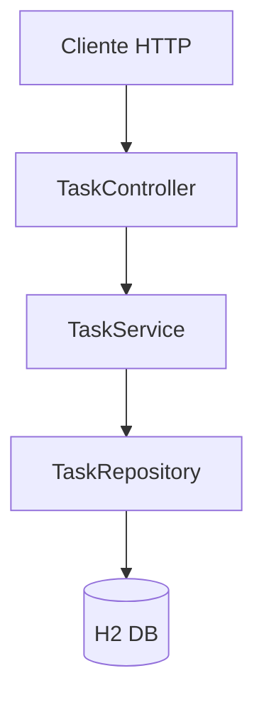
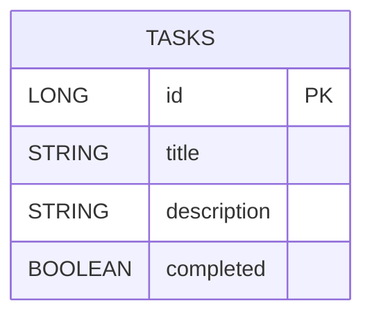
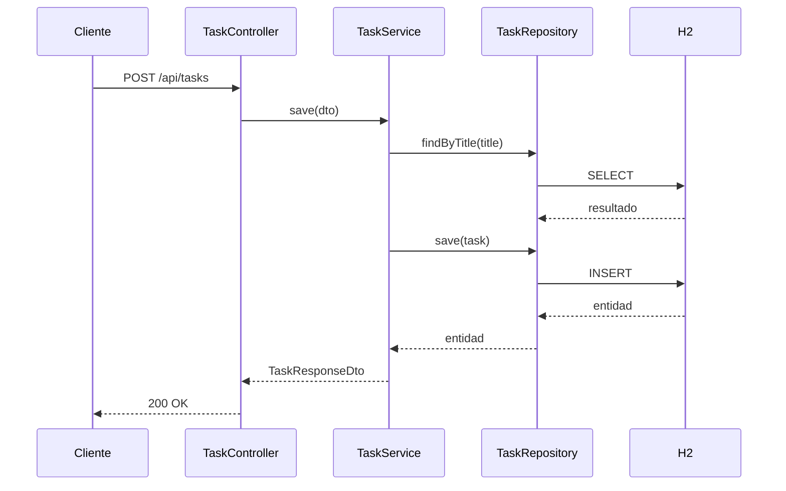

# Gestor de Tareas - Backend

## Resumen
Backend REST para gestionar tareas con Spring Boot, JPA y base de datos en memoria H2. Expone operaciones CRUD con validaciones y manejo de errores consistente.

## Stack y dependencias
- Java 17
- Spring Boot 4.0.3
- Spring Web MVC
- Spring Data JPA
- Validation (Jakarta)
- H2 (runtime)
- Lombok

## Configuracion
Archivo `src/main/resources/application.properties`:
- `spring.application.name=gestor-de-tareas`
- `server.port=8081`

Base URL por defecto: `http://localhost:8081`

## Estructura de paquetes
- `controller`: endpoints REST
- `service` / `service.impl`: logica de negocio
- `repository`: acceso a datos con JPA
- `entity`: modelo de datos
- `dto`: contratos de entrada/salida
- `exception`: errores de dominio y handler global

## Modelo de datos
Entidad `Task`:
- `id` (Long, autogenerado)
- `title` (String)
- `description` (String)
- `completed` (boolean)

## Endpoints
Ruta base: `/api/tasks`

### GET /api/tasks
Obtiene tareas. Permite filtros por query params.
- `?title=...` busca por titulo exacto
- `?id=...` busca por id
- sin parametros: lista todas

Respuesta: `200 OK`
```json
[
  {
    "id": 1,
    "title": "Comprar pan",
    "description": "Ir a la tienda",
    "completed": false
  }
]
```

### POST /api/tasks
Crea una tarea.

Request body:
```json
{
  "title": "Comprar pan",
  "description": "Ir a la tienda",
  "completed": false
}
```

Reglas:
- `title` es obligatorio y no puede estar en blanco
- si ya existe un titulo igual, devuelve error

Respuesta: `200 OK`
```json
{
  "id": 1,
  "title": "Comprar pan",
  "description": "Ir a la tienda",
  "completed": false
}
```

### PATCH /api/tasks/{id}
Actualiza una tarea existente.

Request body (parcial):
```json
{
  "title": "Comprar pan y leche",
  "description": "Ir a la tienda",
  "completed": true
}
```

Notas:
- `title` y `description` se actualizan solo si vienen en el body
- `completed` se actualiza siempre (si no se envia, queda `false` por defecto)

Respuesta: `200 OK`
```json
{
  "id": 1,
  "title": "Comprar pan y leche",
  "description": "Ir a la tienda",
  "completed": true
}
```

### DELETE /api/tasks/{id}
Elimina una tarea por id.

Respuesta: `200 OK`
```text
task eliminada correctamente
```

## Errores y validaciones
El `GlobalExceptionHandler` estandariza errores con el formato:
```json
{
  "message": "Validation failed",
  "status": 400,
  "timestamp": "2026-02-23T10:30:00",
  "errors": {
    "title": "Title cannot be blank"
  }
}
```

Casos comunes:
- `400 Bad Request` por validacion o cuando no se encuentra la tarea
- `404 Not Found` si se lanza `ResourceNotFoundException`
- `500 Internal Server Error` para errores inesperados

## Diagramas

### Arquitectura en capas


### Entidad y tabla


### Secuencia: crear tarea


## Ejemplos rapidos con curl
```bash
curl -X POST "http://localhost:8081/api/tasks" -H "Content-Type: application/json" -d "{\"title\":\"Comprar pan\",\"description\":\"Ir a la tienda\",\"completed\":false}"

curl "http://localhost:8081/api/tasks"

curl -X PATCH "http://localhost:8081/api/tasks/1" -H "Content-Type: application/json" -d "{\"completed\":true}"

curl -X DELETE "http://localhost:8081/api/tasks/1"
```
