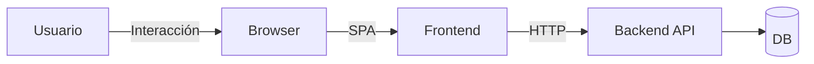
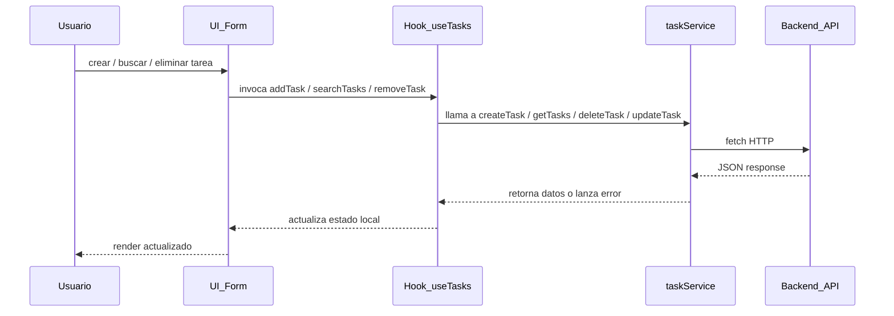

**Gestor de Tareas — Frontend**

Este repositorio contiene el frontend del ``Gestor de Tareas`` — una SPA construida con React, TypeScript, Vite y TailwindCSS. A continuación se documenta la arquitectura, flujo de datos, componentes clave, decisiones de diseño y cómo ejecutar el proyecto.

**Resumen**
- **Propósito:** Interfaz para listar, crear, buscar, actualizar y eliminar tareas.
- **Stack:** React 19 + TypeScript, Vite, TailwindCSS.
- **Punto de entrada:** [taskApi/src/main.tsx](taskApi/src/main.tsx)

**Estructura del Proyecto**
- **Configuración / Scripts:** [taskApi/package.json](taskApi/package.json)
- **Entrypoint:** [taskApi/src/main.tsx](taskApi/src/main.tsx)
- **App wrapper:** [taskApi/src/app/App.tsx](taskApi/src/app/App.tsx)
- **Página de tareas:** [taskApi/src/features/tasks/pages/TaskPage.tsx](taskApi/src/features/tasks/pages/TaskPage.tsx)
- **Componentes:**
	- [taskApi/src/features/tasks/components/TaskForm.tsx](taskApi/src/features/tasks/components/TaskForm.tsx)
	- [taskApi/src/features/tasks/components/TaskSearch.tsx](taskApi/src/features/tasks/components/TaskSearch.tsx) (búsqueda)
	- [taskApi/src/features/tasks/components/TaskList.tsx](taskApi/src/features/tasks/components/TaskList.tsx)
	- [taskApi/src/features/tasks/components/TaskItem.tsx](taskApi/src/features/tasks/components/TaskItem.tsx)
	- [taskApi/src/features/tasks/components/TaskEmptyState.tsx](taskApi/src/features/tasks/components/TaskEmptyState.tsx)
	- [taskApi/src/features/tasks/components/TaskErrorMessage.tsx](taskApi/src/features/tasks/components/TaskErrorMessage.tsx)
- **Hook de lógica:** [taskApi/src/features/tasks/hooks/useTasks.ts](taskApi/src/features/tasks/hooks/useTasks.ts)
- **Servicios (API):** [taskApi/src/features/tasks/services/taskService.ts](taskApi/src/features/tasks/services/taskService.ts)
- **Tipos:** [taskApi/src/features/tasks/types/task.types.ts](taskApi/src/features/tasks/types/task.types.ts)

**Arquitectura (diagrama)**


**Flujo de la aplicación (secuencia)**



**Descripción de componentes y responsabilidades**
- **TaskPage (pagina):** Orquesta la UI: monta `TaskForm`, `TaskSearch`, `TaskList` y muestra errores/estado. Archivo: [taskApi/src/features/tasks/pages/TaskPage.tsx](taskApi/src/features/tasks/pages/TaskPage.tsx)
- **TaskForm:** Formulario controlado para crear tareas. Llama a `onAddTask` pasado desde el hook. Archivo: [taskApi/src/features/tasks/components/TaskForm.tsx](taskApi/src/features/tasks/components/TaskForm.tsx)
- **TaskSearch:** Entrada para búsquedas (comunica con el hook para filtrar tareas).
- **TaskList / TaskItem:** Render de lista, estados de carga y vacíos. `TaskItem` maneja toggle completo y eliminación.
- **useTasks (hook):** Contiene la lógica de estado (tareas, loading, errors, búsqueda, submit). Es el único lugar donde se usa `taskService`.
- **taskService:** Abstracción HTTP hacia la API. Implementa `getTasks`, `createTask`, `deleteTask`, `updateTask`. Usa `VITE_API_URL` con fallback `http://localhost:8081/api/tasks`. Archivo: [taskApi/src/features/tasks/services/taskService.ts](taskApi/src/features/tasks/services/taskService.ts)
- **Tipos:** Interfaz `Task` y `CreateTaskRequest` en [taskApi/src/features/tasks/types/task.types.ts](taskApi/src/features/tasks/types/task.types.ts)


**Cómo ejecutar (desarrollo)**
En la carpeta `taskApi`:

```bash
cd taskApi
npm install
npm run dev
```

- `npm run dev` inicia Vite en modo desarrollo. La app espera la API disponible en `VITE_API_URL`.
- Para producción: `npm run build` crea los artefactos (requiere TypeScript build y Vite build).
